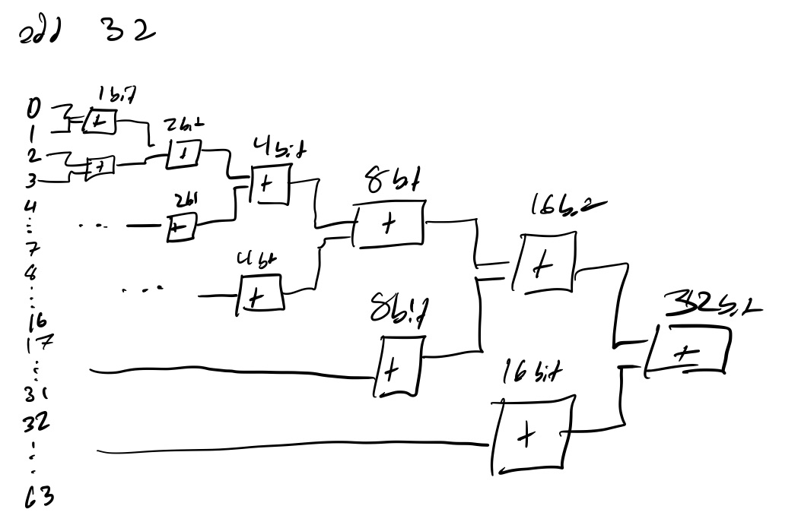

# Homework 4

## 32 Bit Wide Adder

`add32.sv` contains a 32 bit wide ripple carry adder. It was built using 1 bit, 2 bit, 4 bit, 8 bit, and 16 bit adders to build up to a 32 bit adder. The implementation of these adders is shown in the figure below.
 

## 32 Bit Wide 32:1 Mux

`mux32.sv` contains a N bit wide 32:1 mux. It was built using 4:1 muxes and a 2:1 mux, and the implementation of this mux is shown in the figure below. The implementation of this 32:1 mux uses a parameter N such that the inputs can be any number of bits wide. 
 

## Testing
The adder can be tested by running `make test_adder32` while the mux can be tested by running `make test_mux32`. Both will diplay the tests and alert the user to any errors. 